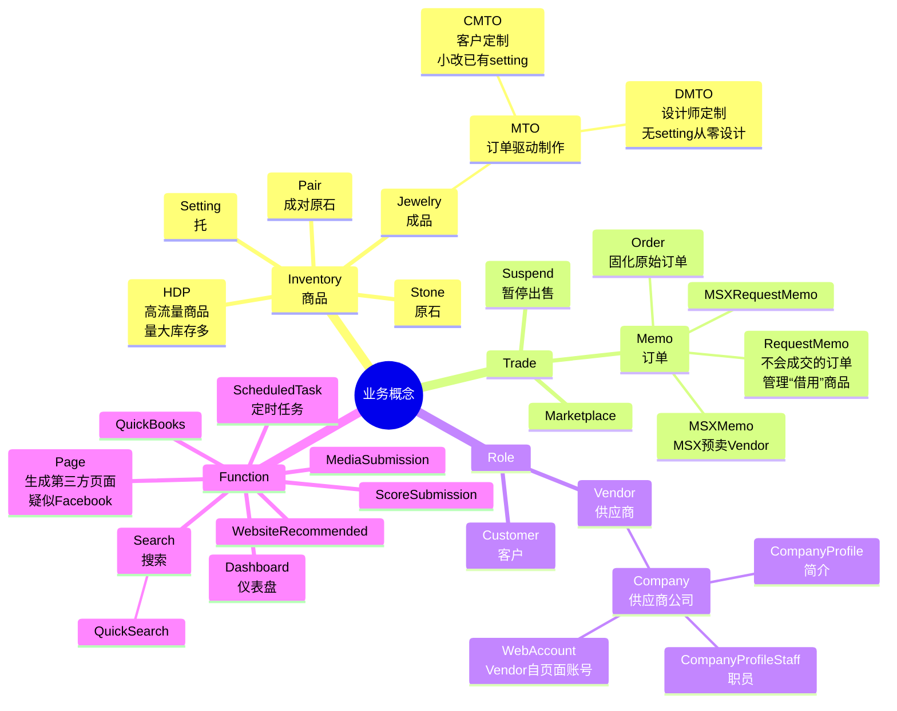

```mermaid
mindmap
  root((业务概念))
    Inventory<br />商品
        Pair<br />成对原石
        Stone<br />原石
        Jewelry<br />成品
            MTO<br />订单驱动制作
                CMTO<br />客户定制<br />小改已有setting
                DMTO<br />设计师定制<br />无setting从零设计
        Setting <br />托
        HDP<br />高流量商品<br />量大库存多

    Trade
        Marketplace
        Suspend<br />暂停出售
        Memo<br />订单
            Order<br />固化原始订单
            RequestMemo<br />不会成交的订单<br />管理“借用”商品
            MSXMemo<br />MSX预卖Vendor
            MSXRequestMemo
    
    Role
        Vendor<br />供应商
            Company<br />供应商公司
                CompanyProfile<br />简介
                CompanyProfileStaff<br />职员
                WebAccount<br />Vendor自页面账号
        Customer<br />客户
    
    Function
        
        ScoreSubmission
        MediaSubmission
        Page <br />生成第三方页面<br />疑似Facebook
        WebsiteRecommended
        Search<br />搜索
            QuickSearch
        QuickBooks
        Dashboard<br />仪表盘
        ScheduledTask<br />定时任务
```