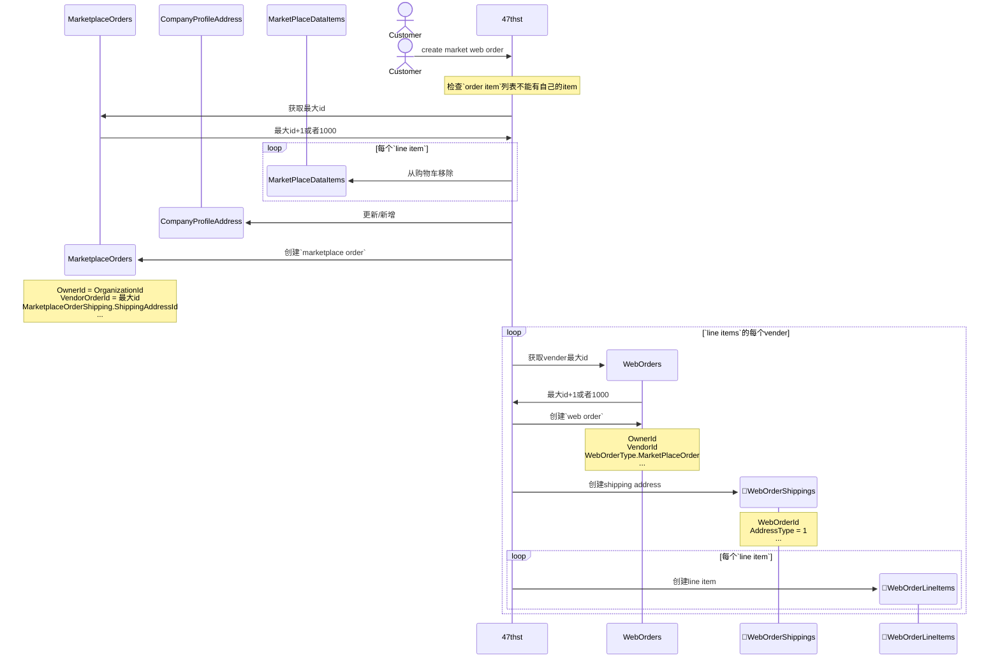

## create marketplace order

```mermaid
sequenceDiagram
    participant MarketplaceOrders
    participant CompanyProfileAddress
    participant MarketPlaceDataItems
    Actor Customer
    destroy Customer
    Customer ->> 47thst: create market web order
    
    note over 47thst: 检查`order item`列表不能有自己的item
    47thst ->> MarketplaceOrders: 获取最大id
    MarketplaceOrders ->> 47thst: 最大id+1或者1000
    loop 每个`line item`
        destroy MarketPlaceDataItems
        47thst ->> MarketPlaceDataItems: 从购物车移除
    end
    destroy CompanyProfileAddress
    47thst ->> CompanyProfileAddress: 更新/新增
    destroy MarketplaceOrders
    47thst ->> MarketplaceOrders: 创建`marketplace order`
    note over MarketplaceOrders: OwnerId = OrganizationId <br/> VendorOrderId = 最大id <br/> MarketplaceOrderShipping.ShippingAddressId <br> ...
    
    loop `line items`的每个vender
        create participant WebOrders
        47thst ->> WebOrders: 获取vender最大id
        WebOrders ->> 47thst: 最大id+1或者1000
        47thst ->> WebOrders: 创建`web order`
        note over WebOrders: OwnerId <br/> VendorId <br/> WebOrderType.MarketPlaceOrder <br/>...
        create participant 💾WebOrderShippings
        47thst ->> 💾WebOrderShippings: 创建shipping address
        note over 💾WebOrderShippings: WebOrderId<br>AddressType = 1<br>...
        loop 每个`line item`
            create participant 💾WebOrderLineItems
            47thst ->> 💾WebOrderLineItems: 创建line item
        end
    end
```
