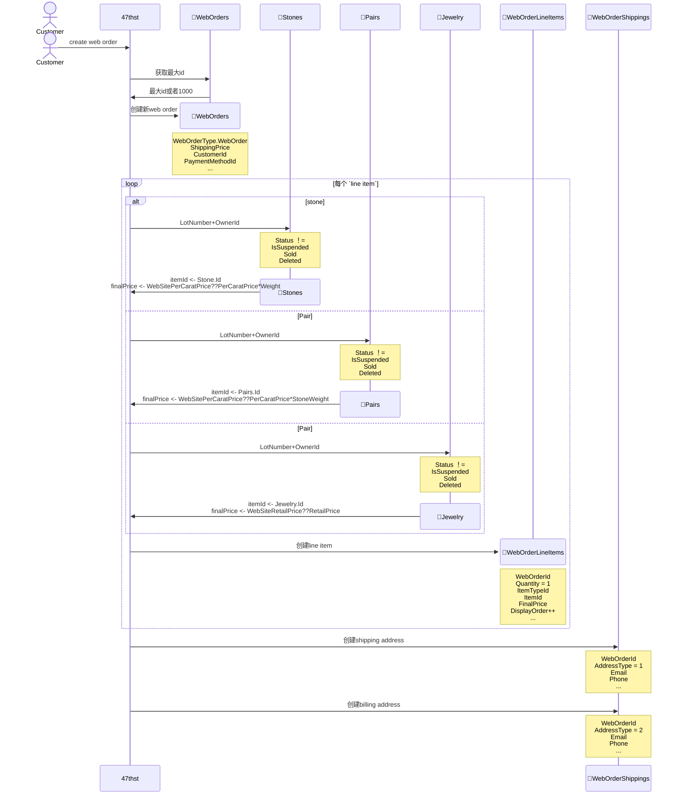

## create web order

```mermaid
sequenceDiagram
    Actor Customer
    destroy Customer
    Customer ->> 47thst: create web order
    47thst ->> 💾WebOrders: 获取最大id
    💾WebOrders ->> 47thst: 最大id或者1000
    destroy 💾WebOrders
    47thst ->> 💾WebOrders: 创建新web order
    note over 💾WebOrders: WebOrderType.WebOrder<br>ShippingPrice<br>CustomerId<br>PaymentMethodId<br>...
    loop 每个 `line item`
        alt stone
            47thst->>💾Stones: LotNumber+OwnerId
            note over 💾Stones: Status ！= <br/>IsSuspended<br/>Sold<br/>Deleted
            destroy 💾Stones
            💾Stones->>47thst: itemId <- Stone.Id<br> finalPrice <- WebSitePerCaratPrice??PerCaratPrice*Weight
        else Pair
            47thst->>💾Pairs: LotNumber+OwnerId
            note over 💾Pairs: Status ！= <br/>IsSuspended<br/>Sold<br/>Deleted
            destroy 💾Pairs
            💾Pairs->>47thst: itemId <- Pairs.Id<br> finalPrice <- WebSitePerCaratPrice??PerCaratPrice*StoneWeight
        else Pair
            47thst->>💾Jewelry: LotNumber+OwnerId
            note over 💾Jewelry: Status ！= <br/>IsSuspended<br/>Sold<br/>Deleted
            destroy 💾Jewelry
            💾Jewelry->>47thst: itemId <- Jewelry.Id<br> finalPrice <- WebSiteRetailPrice??RetailPrice
        end
        destroy 💾WebOrderLineItems
        47thst ->> 💾WebOrderLineItems: 创建line item
        note over 💾WebOrderLineItems: WebOrderId<br>Quantity = 1<br>ItemTypeId<br>ItemId<br>FinalPrice<br>DisplayOrder++<br>...
    end
    47thst ->> 💾WebOrderShippings: 创建shipping address
    note over 💾WebOrderShippings: WebOrderId<br>AddressType = 1<br>Email<br>Phone<br>...
    47thst ->> 💾WebOrderShippings: 创建billing address
    note over 💾WebOrderShippings: WebOrderId<br>AddressType = 2<br>Email<br>Phone<br>...
```
