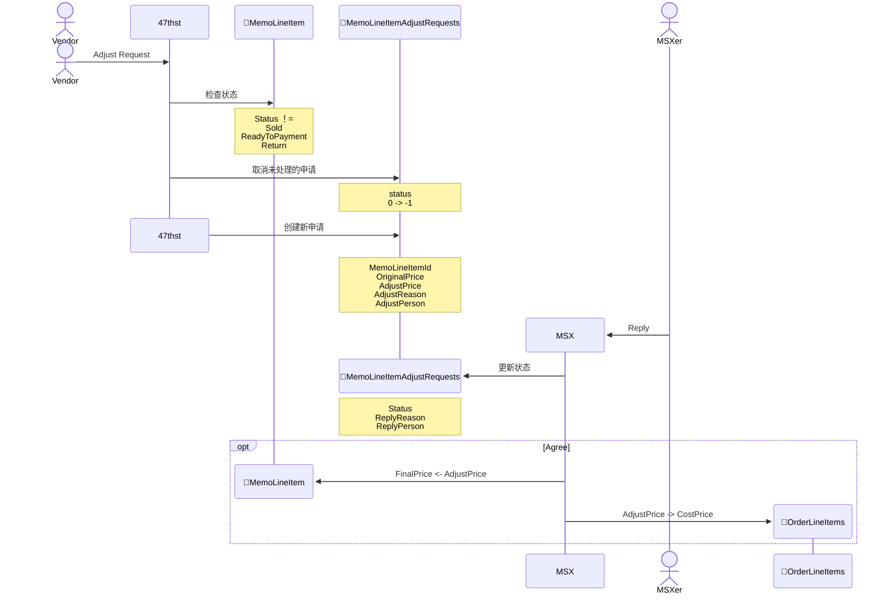

## memo line item adjust price

```mermaid
sequenceDiagram
    Actor Vendor
    destroy Vendor
    Vendor ->> 47thst: Adjust Request
    47thst ->> 💾MemoLineItem: 检查状态
    note over 💾MemoLineItem: Status ！= <br/>Sold<br/>ReadyToPayment<br/>Return
    47thst ->> 💾MemoLineItemAdjustRequests: 取消未处理的申请
    note over 💾MemoLineItemAdjustRequests: status <br/> 0 -> -1
    destroy 47thst
    47thst ->> 💾MemoLineItemAdjustRequests:创建新申请
    note over 💾MemoLineItemAdjustRequests: MemoLineItemId<br>OriginalPrice<br>AdjustPrice<br>AdjustReason<br>AdjustPerson

    create participant MSX
    Actor MSXer
    MSXer ->> MSX: Reply
    destroy 💾MemoLineItemAdjustRequests
    MSX ->> 💾MemoLineItemAdjustRequests: 更新状态
    note over 💾MemoLineItemAdjustRequests: Status<br>ReplyReason<br>ReplyPerson
    opt Agree
        destroy 💾MemoLineItem
        MSX->>💾MemoLineItem: FinalPrice <- AdjustPrice
        create participant 💾OrderLineItems
        MSX->>💾OrderLineItems: AdjustPrice -> CostPrice 
    end

```
