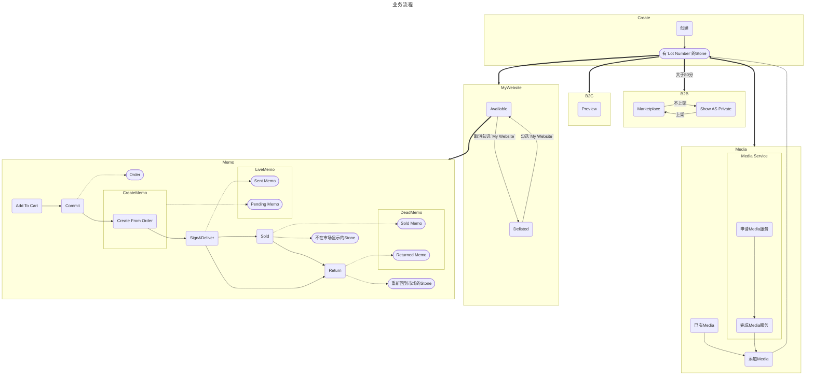

```mermaid
---
title: 业务流程
---
flowchart TD
    subgraph Create
        create_stone(创建) --> Inventory(["有`Lot Number`的Stone"])
    end

    subgraph Media
        self_media(已有Media) --> add_media(添加Media)
        subgraph "Media Service"
            media_service(申请Media服务) --> media_service_done(完成Media服务)
        end
        media_service_done --> add_media
    end
    Inventory ===> Media
    add_media --> Inventory

    subgraph B2B
        market --> |不上架| private
        private(Show AS Private) --> |上架| market(Marketplace)
    end
    Inventory ==> |大于80分| B2B

    subgraph B2C
        create_preview(Preview) 
    end
    Inventory ==> B2C

    subgraph MyWebsite
        available --> |取消勾选`My Website`| Delisted
        Delisted(Delisted) --> |勾选`My Website`| available(Available) 
    end
    Inventory ==> MyWebsite

    subgraph Memo
        add_to_cart(Add To Cart) --> commit(Commit)
        commit -.-> order([Order])
        commit --> create_from_order
        subgraph CreateMemo
            create_from_order(Create From Order)
        end
        create_from_order --> sign_deliver(Sign&Deliver)
        sign_deliver --> sold(Sold)
        sold --> return(Return)
        sign_deliver --> return(Return)
        subgraph LiveMemo
            pending_memo([Pending Memo])
            sent_memo([Sent Memo])
        end
        subgraph DeadMemo
            sold_memo([Sold Memo])
            returned_memo([Returned Memo])
        end
        CreateMemo -.-> pending_memo
        sign_deliver -.-> sent_memo
        sold -.-> sold_memo
        return -.-> returned_memo
        sold -.-> stone_not_in_market([不在市场显示的Stone])
        return -.-> stone_in_market([重新回到市场的Stone])
    end
    available ==> Memo

```